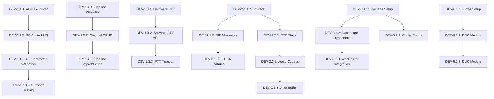

# Task Breakdown - Skylogix SDR VHF/UHF System

## Cấu trúc Task Organization

### Task Categories
- **DEV**: Development tasks
- **TEST**: Testing tasks  
- **DOC**: Documentation tasks
- **CONFIG**: Configuration và setup tasks
- **REVIEW**: Code review và quality assurance tasks

### Priority Levels
- **P0**: Critical - Must be completed first
- **P1**: High - Important for core functionality
- **P2**: Medium - Enhances functionality
- **P3**: Low - Nice to have features

### Effort Estimation
- **XS**: 1-2 hours
- **S**: 0.5-1 day
- **M**: 1-3 days
- **L**: 3-5 days
- **XL**: 1-2 weeks

---

## EPIC 1: Core Radio Software Development

### US1.1: RF Transceiver Control

#### DEV-1.1.1: AD9364 Driver Integration [P0, L]
**Description**: Tích hợp driver AD9364 với Linux kernel và tạo user-space interface
**Acceptance Criteria**:
- [ ] AD9364 IIO driver compiled và loaded
- [ ] Device tree configuration cho AD9364
- [ ] User-space library cho register access
- [ ] Frequency setting API (108-512 MHz)
- [ ] Power control API (1-50W)

**Technical Details**:
```c
// Example API structure
typedef struct {
    uint64_t frequency_hz;
    uint8_t power_level;
    rf_mode_t mode;
    bool tx_enable;
} rf_config_t;

int rf_set_frequency(rf_config_t* config);
int rf_set_power(uint8_t power_dbm);
int rf_set_mode(rf_mode_t mode);
```

**Dependencies**: Hardware platform setup
**Assignee**: Senior Embedded Developer
**Estimated Hours**: 32

#### DEV-1.1.2: RF Control API Development [P0, M]
**Description**: Phát triển high-level API cho RF control
**Acceptance Criteria**:
- [ ] RESTful API endpoints cho RF control
- [ ] Input validation và error handling
- [ ] Thread-safe operations
- [ ] Configuration persistence
- [ ] Status monitoring

**API Endpoints**:
```
POST /api/v1/rf/frequency
PUT  /api/v1/rf/power
GET  /api/v1/rf/status
POST /api/v1/rf/mode
```

**Dependencies**: DEV-1.1.1
**Assignee**: Backend Developer
**Estimated Hours**: 24

#### DEV-1.1.3: RF Parameter Validation [P1, S]
**Description**: Implement validation logic cho RF parameters
**Acceptance Criteria**:
- [ ] Frequency range validation (108-174 MHz VHF, 225-512 MHz UHF)
- [ ] Power level limits enforcement
- [ ] Mode compatibility checking
- [ ] Hardware capability verification
- [ ] Error reporting với meaningful messages

**Dependencies**: DEV-1.1.2
**Assignee**: Backend Developer
**Estimated Hours**: 8

#### TEST-1.1.1: RF Control Unit Testing [P1, M]
**Description**: Comprehensive unit testing cho RF control functions
**Acceptance Criteria**:
- [ ] Test coverage > 90%
- [ ] Boundary condition testing
- [ ] Error condition testing
- [ ] Mock hardware interface
- [ ] Automated test execution

**Dependencies**: DEV-1.1.2
**Assignee**: QA Engineer
**Estimated Hours**: 16

### US1.2: Channel Management System

#### DEV-1.2.1: Channel Database Schema [P1, S]
**Description**: Thiết kế database schema cho channel management
**Acceptance Criteria**:
- [ ] SQLite database schema
- [ ] Channel table với required fields
- [ ] Indexing cho performance
- [ ] Migration scripts
- [ ] Data validation constraints

**Database Schema**:
```sql
CREATE TABLE channels (
    id INTEGER PRIMARY KEY AUTOINCREMENT,
    name VARCHAR(50) NOT NULL,
    frequency_hz BIGINT NOT NULL,
    mode VARCHAR(10) NOT NULL,
    power_level INTEGER DEFAULT 25,
    description TEXT,
    created_at TIMESTAMP DEFAULT CURRENT_TIMESTAMP,
    updated_at TIMESTAMP DEFAULT CURRENT_TIMESTAMP
);

CREATE INDEX idx_channels_frequency ON channels(frequency_hz);
CREATE INDEX idx_channels_name ON channels(name);
```

**Dependencies**: None
**Assignee**: Database Developer
**Estimated Hours**: 6

#### DEV-1.2.2: Channel CRUD Operations [P1, M]
**Description**: Implement Create, Read, Update, Delete operations cho channels
**Acceptance Criteria**:
- [ ] Create new channel với validation
- [ ] Read channels với filtering và sorting
- [ ] Update existing channels
- [ ] Delete channels với confirmation
- [ ] Bulk operations support

**API Design**:
```
GET    /api/v1/channels
POST   /api/v1/channels
GET    /api/v1/channels/{id}
PUT    /api/v1/channels/{id}
DELETE /api/v1/channels/{id}
POST   /api/v1/channels/bulk
```

**Dependencies**: DEV-1.2.1
**Assignee**: Backend Developer
**Estimated Hours**: 20

#### DEV-1.2.3: Channel Import/Export [P2, M]
**Description**: Implement CSV import/export functionality
**Acceptance Criteria**:
- [ ] CSV format definition
- [ ] Import validation và error reporting
- [ ] Export với filtering options
- [ ] Backup/restore functionality
- [ ] Progress indication cho large files

**CSV Format**:
```csv
name,frequency_hz,mode,power_level,description
"Tower Control",118250000,"AM",25,"Primary tower frequency"
"Ground Control",121900000,"AM",10,"Ground operations"
```

**Dependencies**: DEV-1.2.2
**Assignee**: Backend Developer
**Estimated Hours**: 16

### US1.3: PTT (Push-to-Talk) Control

#### DEV-1.3.1: Hardware PTT Interface [P0, M]
**Description**: Implement hardware PTT detection và control
**Acceptance Criteria**:
- [ ] GPIO interrupt handler cho PTT input
- [ ] Debouncing logic
- [ ] T/R switching control
- [ ] Status LED control
- [ ] Timeout protection

**Implementation**:
```c
// PTT interrupt handler
void ptt_interrupt_handler(int gpio_pin) {
    static uint32_t last_time = 0;
    uint32_t current_time = get_timestamp_ms();
    
    // Debouncing
    if (current_time - last_time < PTT_DEBOUNCE_MS) {
        return;
    }
    
    bool ptt_active = gpio_read(PTT_GPIO_PIN);
    ptt_state_change(ptt_active);
    last_time = current_time;
}
```

**Dependencies**: Hardware GPIO setup
**Assignee**: Embedded Developer
**Estimated Hours**: 20

#### DEV-1.3.2: Software PTT API [P0, S]
**Description**: Implement software PTT control API
**Acceptance Criteria**:
- [ ] REST API cho PTT control
- [ ] WebSocket notifications cho PTT state
- [ ] PTT state persistence
- [ ] Concurrent access handling
- [ ] Audio routing control

**API Design**:
```
POST /api/v1/ptt/activate
POST /api/v1/ptt/deactivate
GET  /api/v1/ptt/status
WebSocket: /ws/ptt/events
```

**Dependencies**: DEV-1.3.1
**Assignee**: Backend Developer
**Estimated Hours**: 12

#### DEV-1.3.3: PTT Timeout Protection [P1, S]
**Description**: Implement automatic PTT timeout để prevent stuck transmission
**Acceptance Criteria**:
- [ ] Configurable timeout period (default 5 minutes)
- [ ] Warning notifications before timeout
- [ ] Automatic PTT release
- [ ] Event logging
- [ ] Override capability cho emergency

**Dependencies**: DEV-1.3.2
**Assignee**: Backend Developer
**Estimated Hours**: 8

---

## EPIC 2: VoIP Integration (ED-137)

### US2.1: SIP Protocol Implementation

#### DEV-2.1.1: SIP Stack Integration [P0, XL]
**Description**: Tích hợp SIP stack tuân thủ ED-137
**Acceptance Criteria**:
- [ ] PJSIP library integration
- [ ] ED-137 specific extensions
- [ ] SIP registration handling
- [ ] Call establishment/termination
- [ ] Authentication support

**Configuration Example**:
```yaml
sip:
  server: "192.168.1.100"
  port: 5060
  username: "sdr_station_01"
  password: "secure_password"
  realm: "atc.domain.com"
  transport: "UDP"
  ed137_extensions: true
```

**Dependencies**: None
**Assignee**: VoIP Developer
**Estimated Hours**: 60

#### DEV-2.1.2: SIP Message Handling [P0, L]
**Description**: Implement SIP message processing
**Acceptance Criteria**:
- [ ] INVITE message handling
- [ ] BYE message processing
- [ ] REGISTER với authentication
- [ ] OPTIONS keepalive
- [ ] Error response handling

**Dependencies**: DEV-2.1.1
**Assignee**: VoIP Developer
**Estimated Hours**: 32

#### DEV-2.1.3: ED-137 Compliance Features [P1, L]
**Description**: Implement ED-137 specific features
**Acceptance Criteria**:
- [ ] PTT indication trong SIP messages
- [ ] Radio frequency information
- [ ] Call priority handling
- [ ] Emergency call support
- [ ] Multi-frequency operation

**Dependencies**: DEV-2.1.2
**Assignee**: VoIP Developer
**Estimated Hours**: 40

### US2.2: RTP Media Streaming

#### DEV-2.2.1: RTP Stack Implementation [P0, L]
**Description**: Implement RTP media streaming
**Acceptance Criteria**:
- [ ] RTP packet generation/parsing
- [ ] RTCP implementation
- [ ] Codec support (G.711a, G.711u)
- [ ] Jitter buffer implementation
- [ ] Packet loss handling

**Dependencies**: DEV-2.1.1
**Assignee**: Audio Developer
**Estimated Hours**: 36

#### DEV-2.2.2: Audio Codec Integration [P0, M]
**Description**: Integrate audio codecs cho VoIP
**Acceptance Criteria**:
- [ ] G.711 A-law/μ-law codecs
- [ ] Real-time encoding/decoding
- [ ] Sample rate conversion
- [ ] Audio quality optimization
- [ ] CPU usage optimization

**Dependencies**: DEV-2.2.1
**Assignee**: Audio Developer
**Estimated Hours**: 24

#### DEV-2.2.3: Jitter Buffer Optimization [P1, M]
**Description**: Implement adaptive jitter buffer
**Acceptance Criteria**:
- [ ] Adaptive buffer sizing (20-90ms)
- [ ] Packet reordering
- [ ] Late packet handling
- [ ] Buffer underrun/overrun protection
- [ ] Quality metrics collection

**Dependencies**: DEV-2.2.2
**Assignee**: Audio Developer
**Estimated Hours**: 20

---

## EPIC 3: Web Management Interface

### US3.1: System Dashboard

#### DEV-3.1.1: Frontend Framework Setup [P0, M]
**Description**: Setup React TypeScript frontend với modern tooling
**Acceptance Criteria**:
- [ ] React 18 với TypeScript
- [ ] Vite build system
- [ ] Tailwind CSS styling
- [ ] Component library (shadcn/ui)
- [ ] State management (Zustand/Redux)

**Project Structure**:
```
frontend/
├── src/
│   ├── components/
│   │   ├── dashboard/
│   │   ├── rf-control/
│   │   └── common/
│   ├── pages/
│   ├── hooks/
│   ├── services/
│   └── types/
├── public/
└── tests/
```

**Dependencies**: None
**Assignee**: Frontend Developer
**Estimated Hours**: 16

#### DEV-3.1.2: Real-time Dashboard Components [P0, L]
**Description**: Develop dashboard components với real-time updates
**Acceptance Criteria**:
- [ ] RF status display (frequency, power, VSWR)
- [ ] System metrics (CPU, memory, temperature)
- [ ] Network status indicators
- [ ] Active call information
- [ ] WebSocket integration cho real-time updates

**Components**:
```typescript
interface DashboardProps {
  rfStatus: RFStatus;
  systemMetrics: SystemMetrics;
  networkStatus: NetworkStatus;
  activeCalls: CallInfo[];
}

const Dashboard: React.FC<DashboardProps> = ({ ... }) => {
  // Component implementation
};
```

**Dependencies**: DEV-3.1.1
**Assignee**: Frontend Developer
**Estimated Hours**: 32

#### DEV-3.1.3: WebSocket Integration [P0, M]
**Description**: Implement WebSocket client cho real-time updates
**Acceptance Criteria**:
- [ ] WebSocket connection management
- [ ] Automatic reconnection
- [ ] Message type handling
- [ ] Error handling và fallback
- [ ] Connection status indication

**Dependencies**: DEV-3.1.2
**Assignee**: Frontend Developer
**Estimated Hours**: 20

### US3.2: Configuration Management

#### DEV-3.2.1: Configuration Forms [P1, L]
**Description**: Develop configuration forms cho system settings
**Acceptance Criteria**:
- [ ] RF parameter configuration
- [ ] Network settings form
- [ ] VoIP configuration
- [ ] User management interface
- [ ] Form validation và error handling

**Dependencies**: DEV-3.1.1
**Assignee**: Frontend Developer
**Estimated Hours**: 36

#### DEV-3.2.2: Configuration API Backend [P1, L]
**Description**: Implement backend API cho configuration management
**Acceptance Criteria**:
- [ ] Configuration CRUD operations
- [ ] Input validation
- [ ] Configuration versioning
- [ ] Backup/restore functionality
- [ ] Hot reload support

**Dependencies**: None
**Assignee**: Backend Developer
**Estimated Hours**: 32

---

## EPIC 4: SNMP Management Agent

### US4.1: SNMP v3 Implementation

#### DEV-4.1.1: SNMP Agent Setup [P1, L]
**Description**: Setup Net-SNMP agent với SNMPv3 support
**Acceptance Criteria**:
- [ ] Net-SNMP daemon configuration
- [ ] SNMPv3 user setup
- [ ] Authentication và encryption
- [ ] Access control configuration
- [ ] Service integration

**Configuration**:
```
# snmpd.conf
createUser snmpuser MD5 authpassword DES privpassword
rouser snmpuser
view systemview included .1.3.6.1.2.1.1
view systemview included .1.3.6.1.4.1.12345
access snmpuser "" any auth exact systemview none none
```

**Dependencies**: None
**Assignee**: System Developer
**Estimated Hours**: 28

#### DEV-4.1.2: Custom MIB Development [P1, L]
**Description**: Develop custom MIB cho SDR-specific parameters
**Acceptance Criteria**:
- [ ] MIB structure definition
- [ ] OID assignments
- [ ] Data type definitions
- [ ] MIB compilation
- [ ] Agent integration

**MIB Structure**:
```
skylogixSDR OBJECT IDENTIFIER ::= { enterprises 12345 }
rfParameters OBJECT IDENTIFIER ::= { skylogixSDR 1 }
voipStatus OBJECT IDENTIFIER ::= { skylogixSDR 2 }
systemHealth OBJECT IDENTIFIER ::= { skylogixSDR 3 }
```

**Dependencies**: DEV-4.1.1
**Assignee**: System Developer
**Estimated Hours**: 32

---

## EPIC 5: Database Services

### US5.1: Configuration Database

#### DEV-5.1.1: Database Schema Design [P1, M]
**Description**: Design comprehensive database schema
**Acceptance Criteria**:
- [ ] Configuration tables
- [ ] User management tables
- [ ] Audit log tables
- [ ] Performance metrics tables
- [ ] Relationship definitions

**Schema Overview**:
```sql
-- Configuration management
CREATE TABLE config_sections (
    id INTEGER PRIMARY KEY,
    name VARCHAR(50) UNIQUE,
    description TEXT
);

CREATE TABLE config_parameters (
    id INTEGER PRIMARY KEY,
    section_id INTEGER REFERENCES config_sections(id),
    key VARCHAR(100),
    value TEXT,
    data_type VARCHAR(20),
    validation_rule TEXT,
    updated_at TIMESTAMP DEFAULT CURRENT_TIMESTAMP
);

-- User management
CREATE TABLE users (
    id INTEGER PRIMARY KEY,
    username VARCHAR(50) UNIQUE,
    password_hash VARCHAR(255),
    role VARCHAR(20),
    created_at TIMESTAMP DEFAULT CURRENT_TIMESTAMP
);
```

**Dependencies**: None
**Assignee**: Database Developer
**Estimated Hours**: 20

#### DEV-5.1.2: Database Access Layer [P1, M]
**Description**: Implement database access layer với ORM
**Acceptance Criteria**:
- [ ] SQLite connection management
- [ ] CRUD operations
- [ ] Transaction support
- [ ] Connection pooling
- [ ] Error handling

**Dependencies**: DEV-5.1.1
**Assignee**: Backend Developer
**Estimated Hours**: 24

---

## EPIC 6: FPGA Signal Processing

### US6.1: DDC/DUC Implementation

#### DEV-6.1.1: FPGA Project Setup [P0, L]
**Description**: Setup Vivado project cho XCZU-2EG
**Acceptance Criteria**:
- [ ] Vivado project creation
- [ ] XCZU-2EG part selection
- [ ] Constraint files setup
- [ ] IP catalog configuration
- [ ] Build flow setup

**Dependencies**: Hardware platform
**Assignee**: FPGA Developer
**Estimated Hours**: 32

#### DEV-6.1.2: DDC Module Development [P0, XL]
**Description**: Implement Digital Down Converter
**Acceptance Criteria**:
- [ ] NCO (Numerically Controlled Oscillator)
- [ ] Complex mixer
- [ ] Decimation filters
- [ ] Resource optimization
- [ ] Timing closure

**VHDL Structure**:
```vhdl
entity ddc_module is
    generic (
        INPUT_WIDTH  : integer := 16;
        OUTPUT_WIDTH : integer := 16;
        DECIMATION   : integer := 8
    );
    port (
        clk          : in  std_logic;
        rst_n        : in  std_logic;
        freq_word    : in  std_logic_vector(31 downto 0);
        data_in      : in  std_logic_vector(INPUT_WIDTH-1 downto 0);
        data_valid_in: in  std_logic;
        data_out_i   : out std_logic_vector(OUTPUT_WIDTH-1 downto 0);
        data_out_q   : out std_logic_vector(OUTPUT_WIDTH-1 downto 0);
        data_valid_out: out std_logic
    );
end entity;
```

**Dependencies**: DEV-6.1.1
**Assignee**: FPGA Developer
**Estimated Hours**: 80

#### DEV-6.1.3: DUC Module Development [P0, XL]
**Description**: Implement Digital Up Converter
**Acceptance Criteria**:
- [ ] Interpolation filters
- [ ] Complex mixer
- [ ] NCO integration
- [ ] Output formatting
- [ ] Performance optimization

**Dependencies**: DEV-6.1.2
**Assignee**: FPGA Developer
**Estimated Hours**: 72

---

## Testing Tasks

### TEST-INTEGRATION-1: System Integration Testing [P0, XL]
**Description**: Comprehensive system integration testing
**Acceptance Criteria**:
- [ ] Hardware-software integration
- [ ] End-to-end functionality testing
- [ ] Performance benchmarking
- [ ] Stress testing
- [ ] Regression testing

**Test Scenarios**:
1. RF frequency switching performance
2. VoIP call establishment latency
3. Web interface responsiveness
4. SNMP query response time
5. Database transaction performance

**Dependencies**: All development tasks
**Assignee**: QA Team Lead
**Estimated Hours**: 120

### TEST-PERFORMANCE-1: Performance Testing [P1, L]
**Description**: Detailed performance testing và optimization
**Acceptance Criteria**:
- [ ] Latency measurements
- [ ] Throughput testing
- [ ] Resource utilization analysis
- [ ] Memory leak detection
- [ ] CPU profiling

**Dependencies**: Core functionality complete
**Assignee**: Performance Engineer
**Estimated Hours**: 40

---

## Documentation Tasks

### DOC-API-1: API Documentation [P1, M]
**Description**: Comprehensive API documentation
**Acceptance Criteria**:
- [ ] OpenAPI/Swagger specifications
- [ ] Code examples
- [ ] Authentication guide
- [ ] Error code reference
- [ ] SDK documentation

**Dependencies**: API development complete
**Assignee**: Technical Writer
**Estimated Hours**: 24

### DOC-USER-1: User Manual [P2, L]
**Description**: End-user documentation
**Acceptance Criteria**:
- [ ] Installation guide
- [ ] Configuration procedures
- [ ] Operation manual
- [ ] Troubleshooting guide
- [ ] Safety procedures

**Dependencies**: System functionality complete
**Assignee**: Technical Writer
**Estimated Hours**: 40

---

## Task Dependencies Graph



---

## Resource Allocation

### Team Structure
- **Project Manager**: 1 person
- **Senior Embedded Developer**: 1 person
- **FPGA Developer**: 1 person
- **Backend Developers**: 2 people
- **Frontend Developer**: 1 person
- **VoIP/Audio Developer**: 1 person
- **QA Engineers**: 2 people
- **Technical Writer**: 1 person

### Timeline Estimates
- **Phase 1 (Core Development)**: 16 weeks
- **Phase 2 (Integration & Testing)**: 8 weeks
- **Phase 3 (Documentation & Deployment)**: 4 weeks
- **Total Project Duration**: 28 weeks

### Critical Path
1. Hardware platform setup
2. AD9364 driver development
3. FPGA DDC/DUC implementation
4. VoIP stack integration
5. System integration testing
6. Performance optimization
7. Documentation completion

---

## Risk Mitigation

### Technical Risks
- **FPGA resource constraints**: Regular resource utilization monitoring
- **Real-time performance**: Early prototyping và performance testing
- **Hardware integration issues**: Parallel development với simulation

### Schedule Risks
- **Dependency delays**: Buffer time trong critical path
- **Resource availability**: Cross-training team members
- **Scope creep**: Regular stakeholder reviews

### Quality Risks
- **Compliance issues**: Early compliance testing
- **Performance degradation**: Continuous performance monitoring
- **Security vulnerabilities**: Regular security audits
